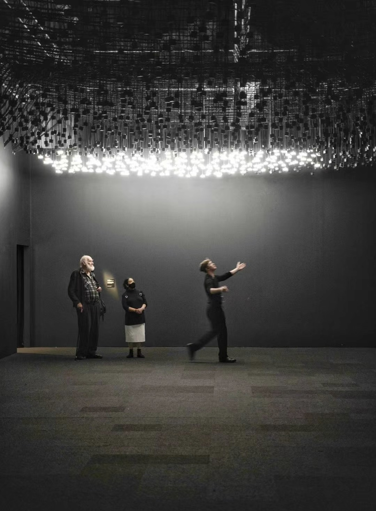
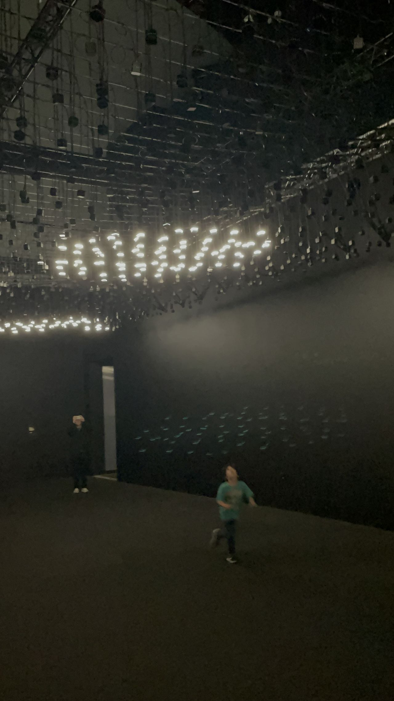
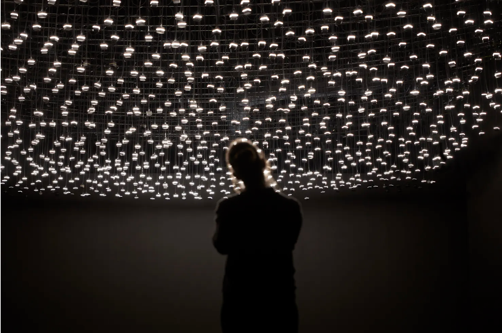
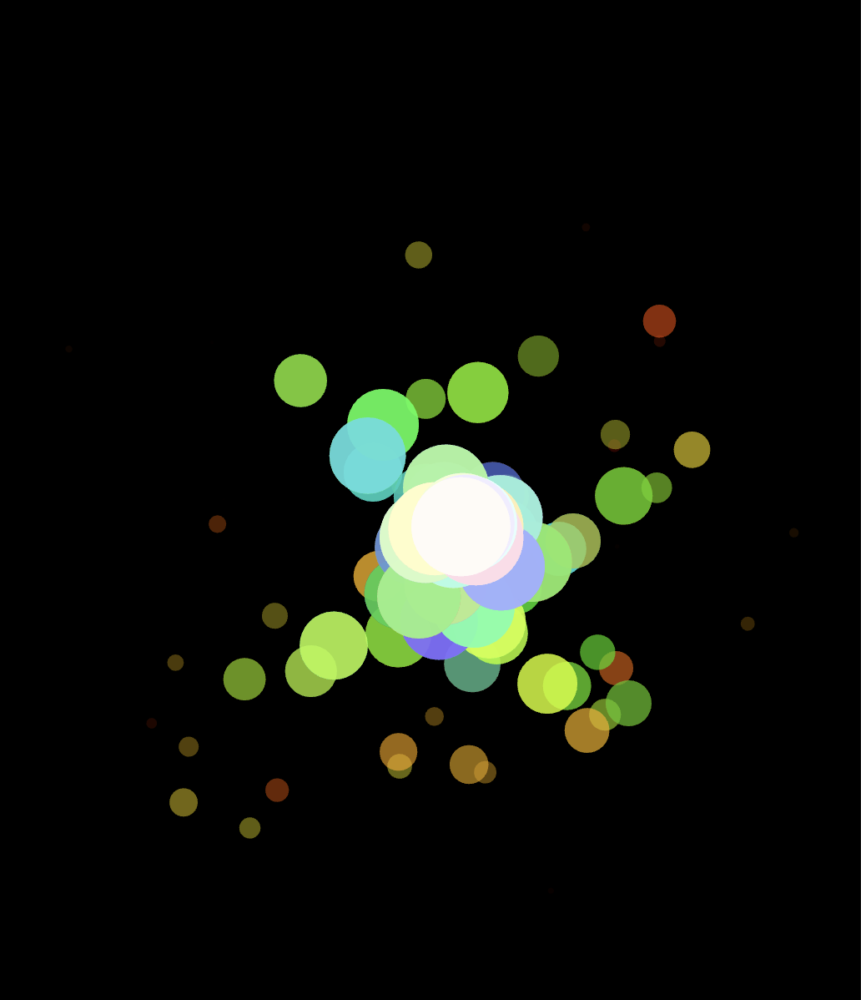
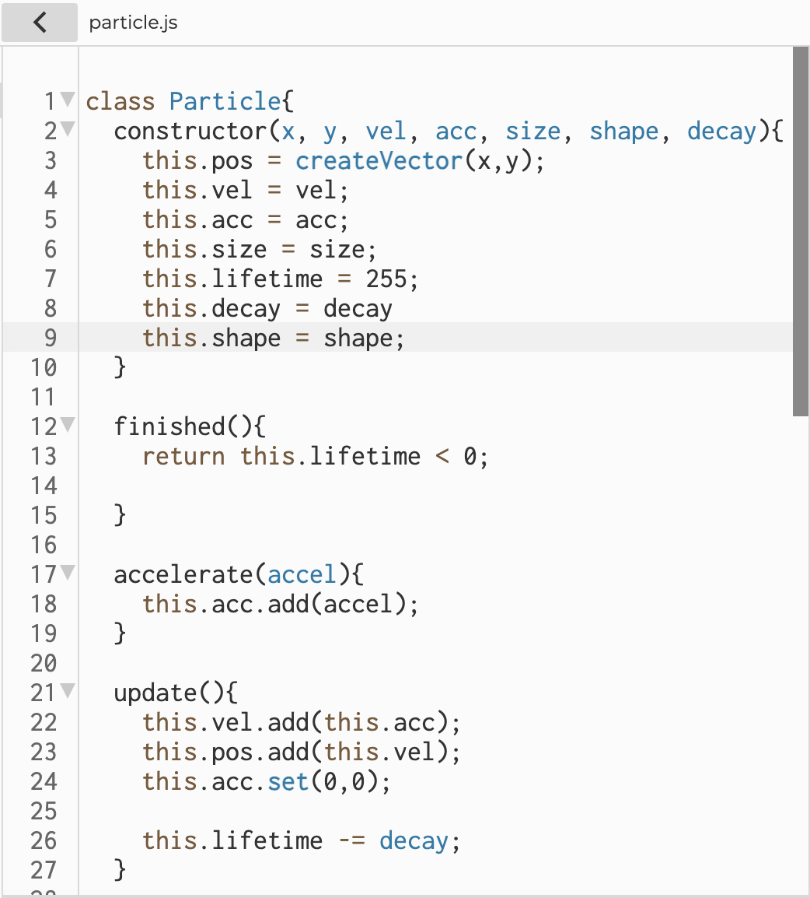
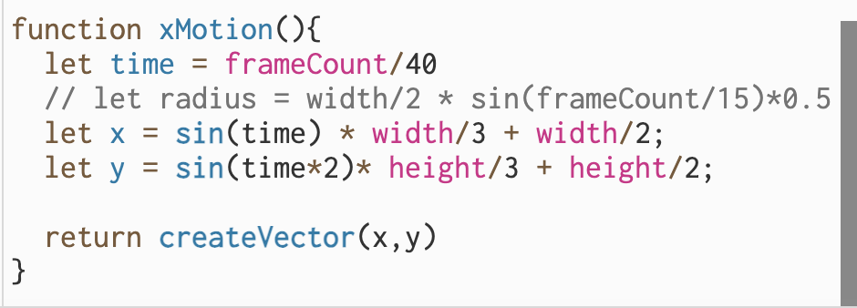
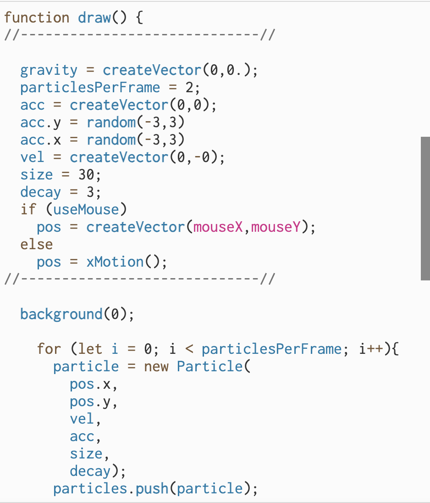

# xgao0429_9103_tut4_newComputer
### Part 1: Imaging Technique Inspiration
**Reference:** Field Atmosphonia(Interactive Device)

**Description:** The interactive device consists of a giant 100 × 100 light matrix. The lights above will light up with the position of the person, and these lights will create some beautiful geometric patterns.

**Imaging Technique:** Create some beautiful geometric shapes around the location of the target object. I can use this as inspiration to produce some beautiful geometric patterns as the mouse moves

**Reference Aspect:**
- The position of the resulting pattern moves as the object moves
- The resulting shapes have a fixed direction of movement or order of disappearance

**Reason for Choice:** It matches one of the four methods listed in the assignment and has good artistic expression effect
#### Image:

### Part 2: Coding Technique Exploration
**Coding Technique:**
- By using mouseX and mouseY variables, the real-time position of the mouse is read, and the effect of the shape generated around the mouse is achieved
- Create and modify a geometry class (such as the Shape class), generate and draw new shape instances based on mouse position, and update and render all instances stored in the array
- By applying a random acceleration vector to each shape, the direction and speed of movement of the produced shape is controlled.

**An example implementation:**
- https://editor.p5js.org/wojtekpaszo/sketches/0VBVCl_Qa
#### Image:

