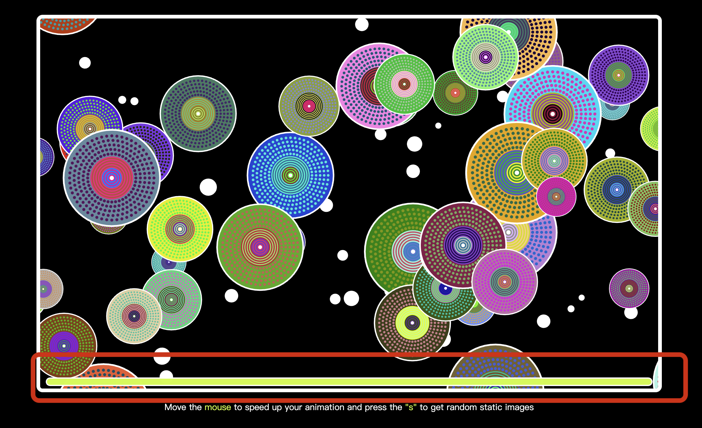

### Project Interaction Statement

**Overview:** 
This is a mouse and keyboard-based interactive animation that simulates the movement of objects in a three-dimensional space: they grow larger when they are close to the audience and shrink when they are far away. The user can speed up the movement of circles within the animation with the mouse, or press the s key to pause the animation and get a random image

**Show Case1:** 
When the mouse is near the left side of the screen, the circle becomes transparent and moves slowly  

**Show Case2:** 
When the mouse is near the right side of the screen, the circle will have a different color and move very fast  

**Show Case3:**  
When the s key is pressed, the user gets a random image similar to Ntange II (Grass)
