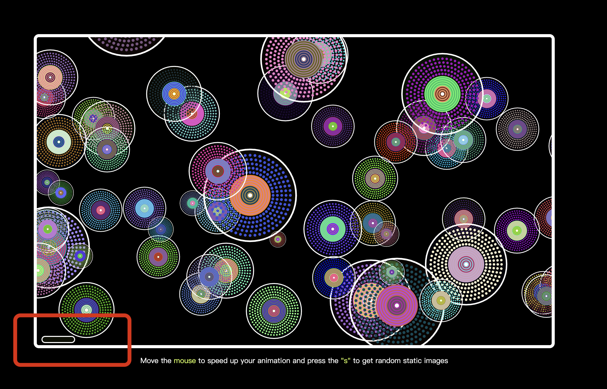

# xgao0429_9103_tut4_newComputer
### Part 1: Imaging Technique Inspiration
**Reference:** Field Atmosphonia(Interactive Device)

**Description:** The interactive device consists of a giant 100 × 100 light matrix. The lights above will light up with the position of the person, and these lights will create some beautiful geometric patterns.

**Imaging Technique:** Create some beautiful geometric pattern around the location of the target object. I can use this as inspiration to produce some beautiful geometric patterns as the mouse moves

**Reference Aspect:**
- The position of the resulting pattern moves as the object moves
- The resulting pattern have a fixed direction of movement or order of disappearance
- The resulting pattern can be controlled(animal, winds, etc.)

**Reason for Choice:** It matches one of the four methods listed in the assignment and has good artistic expression effect
#### Image:

### Part 2: Coding Technique Exploration
**Connection between Parts 1 and 2:**
- The people in part1 are just like the mouse, and using this as inspiration, I can look for some coding technology that produces patterns around the mouse

**Coding Technique:**
- By using mouseX and mouseY variables, the real-time position of the mouse is read, and the effect of the pattern generated around the mouse is achieved
- Create and modify a geometry class (such as the pattern class), generate and draw new pattern instances based on mouse position, and update and render all instances stored in the array
- By applying a random acceleration vector to each pattern, the direction and speed of movement of the produced pattern is controlled.

**An example implementation:**
- https://editor.p5js.org/wojtekpaszo/sketches/0VBVCl_Qa
#### Image:

### Project Interaction Statement
**Overview:**
This is a mouse and keyboard-based interactive animation that simulates the movement of objects in a three-dimensional space: they grow larger when they are close to the audience and shrink when they are far away. The user can speed up the movement of circles within the animation with the mouse, or press the s key to pause the animation and get a random image
**Show Case1:**
When the mouse is near the left side of the screen, the circle becomes transparent and moves slowly

**Show Case2:**
When the mouse is near the right side of the screen, the circle will have a different color and move very fast

**Show Case3:**
When the s key is pressed, the user gets a random image similar to Ntange II (Grass)
